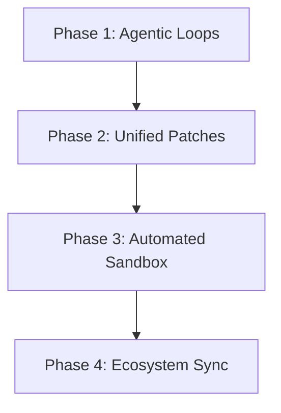

# Jarvis Roadmap

This document outlines the strategic product bets, active milestones, and remaining development phases for Jarvis.

---

## 🚀 Vision: The Next-Gen Private Coding Agent

Jarvis is evolving from a private document chatbot into a high-performance, web-based local coding agent. By pairing **Gemma 4**'s advanced multimodal and reasoning capabilities with a secure local workbench, we are building a private-first developer cockpit.

### Core Architecture Principles:
- **Gemma-Native and Local-First:** Designed around the Gemma 4 family (E2B, E4B, 26B, 31B). Primary focus is local execution via direct llama.cpp GGUFs, using Ollama as an on-demand fallback.
- **Glassmorphic Jarvis UX:** An immersive, high-fidelity dark-mode interface featuring glassmorphic overlays, vibrant gradients, and live agentic activity tracking.
- **Smarter Small Models:** Hybrid semantic/keyword retrieval (Cosine + BM25), reranking, and structured workspace maps allow low-parameter models to punch above their weight.
- **Human-in-the-Loop Trust:** Bounded execution models. Commands are approved or allowlisted, and file edits are proposed as visual diffs before applying.

---

## ⚡ Active & Completed Milestones

### 🎨 Milestone 1: Premium Jarvis UI Overhaul (Active)
- [x] Premium Google Font typography integration (Outfit & Inter).
- [x] Translucent glassmorphic panels and dark-space backdrops.
- [x] High-fidelity neon border outlines and dynamic radial glowing accents.
- [x] Animated, high-end Welcome Screen with futuristic brand vector emblem.
- [x] Polished, scrollable terminal and git diff preview elements.

### 🧠 Milestone 2: Gemma 4 Power Integration (Completed)
- [x] Automatic dropdown model selector in composer (E2B, E4B, 26B, 31B).
- [x] On-demand Ollama downloads for missing Gemma 4 chat models.
- [x] Thinking profiles with system prompts, turn formatting (`<turn|>`), and thought block (`<|think|>`) runtime parsing.
- [x] Pasted image auto-ingestion with vision-model description indexing.
- [x] Geolocation, timezone, and calendar-aware research query generator.

### 🛠️ Milestone 3: Read-Only Workbench & Maps (Completed)
- [x] Directory ingest to create lightweight workspace maps (languages, lines, packages, tests).
- [x] Project-scoped local vector store routing and global indexing fallback.
- [x] Search, preview, summarize, and imports scan tools for codebase exploration.
- [x] Persisted project activity logs, command history, and edit logs.
- [x] Allowlisted local command runner with output capture and background task logs.

---

## 🔮 Upcoming Feature Phases

### Phase 1: Interactive Agent Tool Loop
| Feature | Description | Status |
| :--- | :--- | :---: |
| **Multimodal Tool Planning** | Let the model call tools mid-task: search files, read, summarize, fetch URLs, and request approvals. | 📅 Planned |
| **Command Tool Bindings** | Connect allowlisted commands directly to the agent loop with shell-free validation. | 📅 Planned |
| **Trace Inspector UI** | Visually step through LLM-selected tool execution logs inside the active Workbench panel. | 📅 Planned |

### Phase 2: Visual Patch Application
| Feature | Description | Status |
| :--- | :--- | :---: |
| **Unified Diff Generation** | Prompt Gemma 4 to output precise unified patches instead of full-file rewrites. | 📅 Planned |
| **Visual Patch Inspector** | Review proposed edits side-by-side inside the app with full accept/discard controls. | 📅 Planned |
| **Git Task Branches** | Automatically spin up localized temporary git branches or worktrees to keep main clean. | 📅 Planned |

### Phase 3: Auto-Testing & Self-Healing
| Feature | Description | Status |
| :--- | :--- | :---: |
| **Test & Repair Loop** | Run active project test suites, capture test failures, feed stack traces back to Gemma, and refine code. | 📅 Planned |
| **Direct llama.cpp Backend** | Bundle pure Go GGUF inference to eliminate the mandatory external Ollama dependency. | 📅 Planned |
| **Skills & Rules Engine** | Support reusable execution recipes and repository instructions via `.github/AGENTS.md`. | 📅 Planned |
